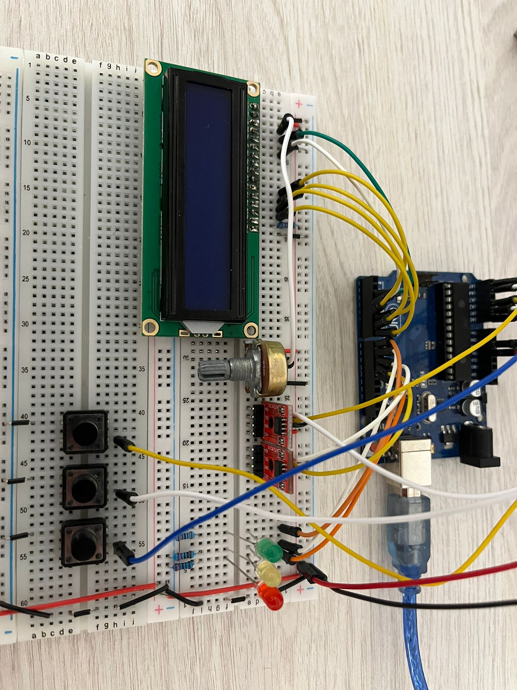

# Memory Hierarchy & Cache Simulator

A hardware-based simulation of a modern processor's memory subsystem, demonstrating cache performance, eviction policies, and memory management on embedded hardware.

<B>General Description</B>

 

This project physically simulates a 3-tier memory hierarchy using an Arduino Uno and external EEPROM modules. It implements multiple cache eviction algorithms, automated benchmarking, and performance analysis.

<B>Bill of Materials</B>

 

| Component | Quantity 
|-----------|----------
| Arduino Uno | 1 |
| AT24CXX EEPROM | 2 |
| 16x2 LCD Display | 1 |
| Push Buttons | 3 |
| LEDs | 3 |
| Potentiometer | 1 |
| Resistors | Various |
| Wires | Various |
| Breadboards | 2 |

<B>Memory Hierarchy</B>

 

- <b>L1 Cache</b>: Implemented in Arduino's internal SRAM.
    - <b>Speed</b>: Instant.
    - <b>Capacity</b>: Very small.
- <b>L2 Cache</b>: External EEPROM module.
    - <b>Speed</b>: Fast.
    - <b>Capacity</b>: Medium.
- <b>Main Memory</b>: External EEPROM module.
    - <b>Speed</b>: Artificially slowed to simulate a Hard Disk / SSD.

<B>Eviction Policies</B>

 

| Policy | Algorithm | Best For |
|--------|-----------|----------|
| **LRU** | Evicts oldest accessed entry | General workloads, temporal locality |
| **LFU** | Evicts least frequently accessed | Hotspot patterns, repeated access |
| **MRU** | Evicts most recently accessed | Streaming data, scan resistance |

<B>Benchmark Patterns</B>

 

| Pattern | Description |
|---------|-------------|
| **SEQUENTIAL** | Addresses 0, 1, 2, 3... |
| **RANDOM** | Random addresses |
| **TEMPORAL** | Small working set (0-3) |
| **STRIDED** | Every 2nd address |
| **HOTSPOT** | 80% to 20% of addresses |
| **COMPARATIVE** | Runs all policies |

<B>Photos</B>

 

<B>Questions</B>

 

<b>Q1 - What is the system boundary?</b>
- <b>Inside</b>: Arduino Uno, EEPROM modules, LCD, buttons.
- <b>Outside</b>: The human user.

<b>Q2 - Where does intelligence live?</b>
- It acts as the controller simulating the CPU, Memory Management Unit, and Cache logic.

<b>Q3 - What is the hardest technical problem?</b>
- Keeping data synchronized across three memory layers using Write-Back.

<b>Q4 - What is the minimum demo?</b>
- Demonstrating a slow cache miss on a specific address, followed immediately by a cache hit on that same address.

<b>Q5 - Why is this not just a tutorial?</b>
- This project builds a custom OS simulation that manages bytes, which requires custom algorithm design.

